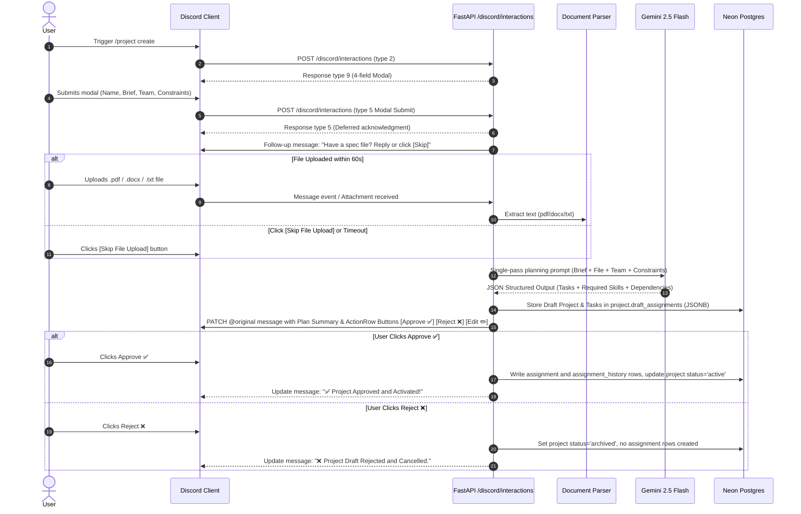

# Agentic Project Creation Architecture & User Flow (Phase 6)

## Overview
Phase 6 replaces manual multi-command project creation with a single agent-driven flow using Gemini (Vertex AI). 
Users submit a project brief via a Discord modal, optionally attach a spec file, review an LLM-generated plan with automated candidate assignments, and approve or reject the plan before any assignment database records are created.

---

## 1. Discord Modal Flow

---

## 2. LLM System & User Prompt Structure

### Verbatim Task Extraction & Constraint Enforcement
To guarantee task fidelity, strict prompt constraints are injected in three places:

1. **System Prompt Rules**:
   - Explicit task preservation: If the user provides explicit bullet points or numbered lists of tasks, extract them verbatim without altering, merging, or omitting titles.
   - Task count capping: Output between 1 and 20 tasks (`min_length=1, max_length=20`).

2. **User Prompt (Prefixed Section)**:
   - Contains raw brief, parsed document text, candidate team members with their current workload, and explicit constraints.

3. **Output Schema Rules (Pydantic)**:
   - `tasks`: List of `TaskPlanItem` (`min_length=1, max_length=20`).

---

## 3. Approval Flow & Deferred Persistence (Amendment 4)

- **Draft Assignments**: Running the deterministic assignment engine before approval produces evidence and scoring, but results are saved ONLY in the `project.draft_assignments` JSONB column.
- **Clean Audit Trail**: No rows are written to `assignments` or `assignment_history` tables during planning.
- **Approve Action**: Writes official `assignments` and `assignment_history` rows, activating the project (`status='active'`).
- **Reject Action**: Discards the plan without creating any assignment records.

---

## 4. Latency Breakdown & SLAs

| Phase | Operation | Expected Latency | Notes |
| :--- | :--- | :--- | :--- |
| 1 | Defer response (`type 5`) | < 100ms | Immediate response to prevent Discord 3s interaction timeout |
| 2 | LLM Planning (Gemini 2.5) | 3 – 8s | Hard timeout cap at 30s |
| 3 | Deterministic Assignment Engine | 1 – 2s | Computes skill, workload, role, experience scores |
| 4 | Webhook PATCH Follow-up | 1s | Renders summary and interactive buttons |
| **Total** | **End-to-End Execution** | **5 – 15s** | Cold start containers may add 2-3s |
